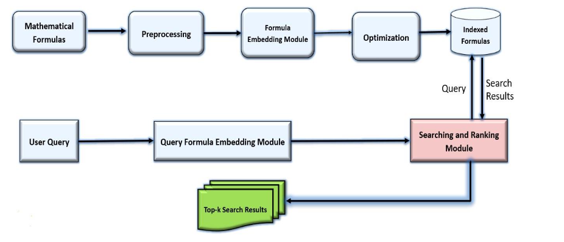
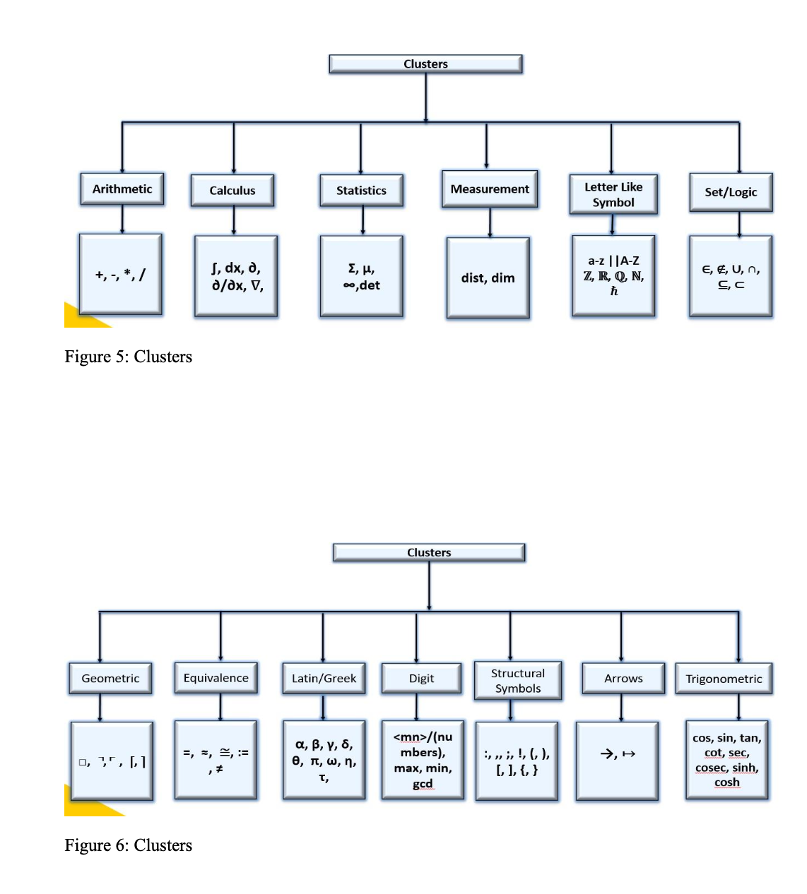

# Search Engine Crawler and Indexer for Mathematical Formulae

This project presents a specialized **Mathematical Information Retrieval (MIR)** system designed to address the unique challenges of indexing, searching, and retrieving mathematical expressions. Leveraging advanced vector-based embeddings and clustering techniques, this system ensures enhanced precision and faster query responses.

## Problem Statement

Traditional information retrieval systems face significant challenges when handling mathematical information due to:

1. **Structural Complexity**: Mathematical formulas are inherently recursive, unlike the linear structure of textual data.
2. **Lack of Math Editors**: Conventional search engines lack built-in math editors for formula-based queries.
3. **Alternative Representations**: Mathematical notations often have multiple valid representations (e.g., \( P_{kn}, nPk, P_{n,k} \)) that need to be treated equivalently.
4. **Ambiguity**: Formulas like \( f(x) \) can imply either the multiplication of variables \( f \) and \( x \) or a function \( f \) of \( x \).
5. **Symbol Challenges**: Variations in scripting styles and typefaces make symbol identification difficult.
6. **Encoding Limitations**: Formats like LaTeX, MathML, and Unicode often include redundant elements that complicate retrieval.
7. **User Query Variability**: Users may search for subformulas, similar formulas, or parent formulas without knowing the exact representation.
8. **Rich Representations**: Mathematical encodings include redundant elements and attributes, creating semantically rich but complex formulas.

## Data Description

The system utilizes the **MathTagArticles** dataset from the Wikipedia corpus of **NTCIR-12**, which contains:

- **Size**: 2.1 GB
- **Number of Articles**: 31,839
- **Article Format**: HTML
- **Formula Formats**: LaTeX, Presentation MathML, and Content MathML
- **Number of Formulas**: 579,608
- **Number of Test Queries**: 40 (Wikipedia Formula Browsing Task)

**Example Representations**:
- Presentation MathML: `\(<math>...</math>`
- Content MathML: `\(<semantics>...</semantics>`
- LaTeX: `$x^2 - 2x + 1$`

**Techincal Diagram**:

## Experimental Results

### Impact of Clustering on System Performance

The introduction of clustering significantly improved the system's performance by:

- **Improving Query Response Time**: Narrowing the search space allows faster query processing.
- **Enhancing Retrieval Accuracy**: Precision metrics show marked improvements over existing methods.

| Method          | P@5  | P@10 |
|-----------------|-------|------|
| Method 1 [31]   | 0.64  | 0.54 |
| Method 2 [20]   | 0.34  | 0.26 |
| Method 3 [6]    | 0.37  | 0.31 |
| **Proposed Approach** | **0.86** | **0.60** |

## Features

- **Vector-based Embedding**: Transforms formulas into 202-bit binary vectors.
- **Clustering**: Organizes data into 13 clusters for enhanced efficiency.
- **Flexible Query Handling**: Supports subformula, similar formula, and parent formula searches.
- **Focus on Presentation MathML**: Specifically processes MathML for indexing and retrieval.
- **Performance Evaluation**: Uses metrics like P@5 and P@10 for validation.

